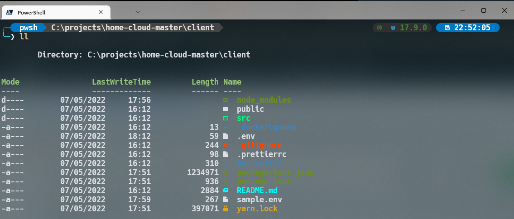
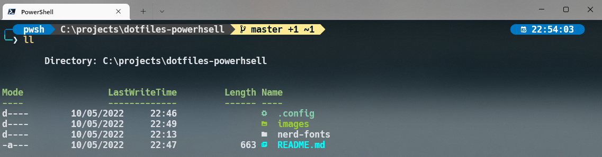
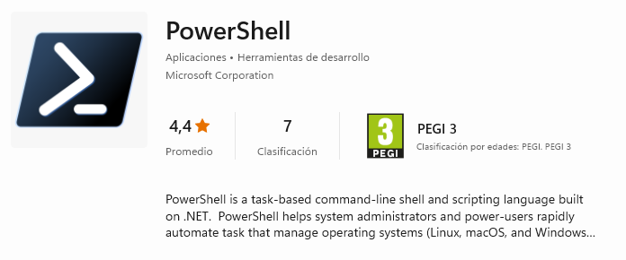

# How to set up PowerShell prompt with Windows Terminal



## Ingredients 👨🏻‍🍳
- [Nerd Fonts](https://github.com/ryanoasis/nerd-fonts) - Hack
- [Scoop](https://scoop.sh/) - A command-line installer
- [Oh My Posh](https://ohmyposh.dev/) - Prompt theme engine
- [Terminal Icons](https://github.com/devblackops/Terminal-Icons) - Folder and file icons
- [PSReadLine](https://docs.microsoft.com/en-us/powershell/module/psreadline/) - Cmdlets for customizing the editing environment, used for autocompletion
- [PSFzf](https://github.com/kelleyma49/PSFzf) - Fuzzy finder

## Checklist 🛠️

- Descargar powershell de Microsoft Store:

    

- Instalar la fuente:
    - Hack
- Personalizar desde los ajustes de windows terminal:
    - Transparencia:
    - Asignar la nueva fuente instalada
- Instalar scoop:
    ```
    iwr -useb get.scoop.sh | iex
    ```
- Instalar neovim:
    ```
    scoop install neovim gcc
    ```

### Profile Powerhsell
The first step in creating your own profile is to test if you already have a profile. Open PowerShell and type:

```
test-path $profile
```

If it returns False, then we need to create the profile first, type:

```
New-Item -Path $profile -Type File -Force
```

### Modules:
```
Install-Module posh-git -Scope CurrentUser -Force
```
```
scoop install https://github.com/JanDeDobbeleer/oh-my-posh/releases/latest/download/oh-my-posh.json
```

```
Install-Module -Name Terminal-Icons -Repository PSGallery -Force
```

```
Install-Module -Name z -Force
```

```
Install-Module -Name PSReadLine -AllowPrerelease -Scope CurrentUser -Force -SkipPublisherCheck
```

```
scoop install fzf
```

```
Install-Module -Name PSFzf -Scope CurrentUser -Force
```

