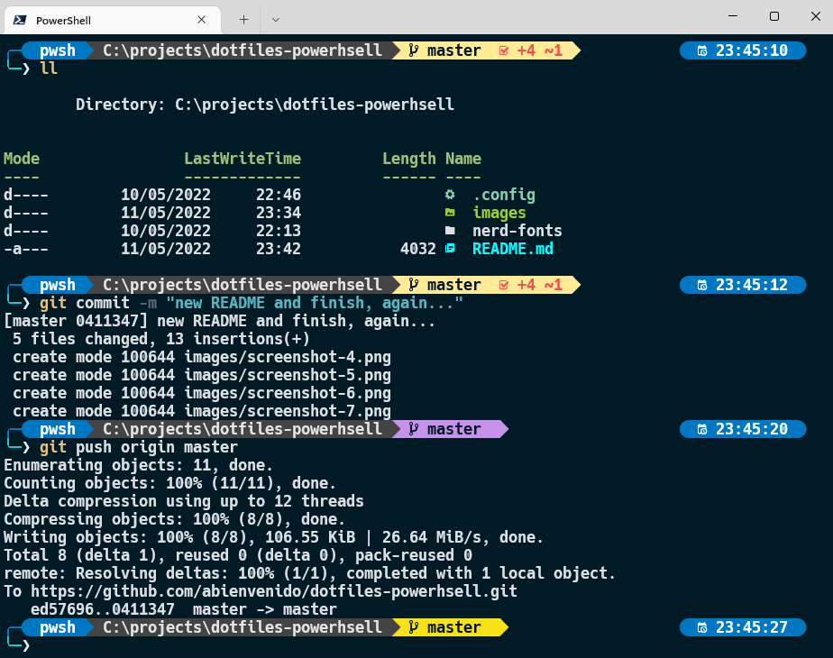

# How to set up PowerShell prompt with Windows Terminal


# Ingredients 👨🏻‍🍳
- [Nerd Fonts](https://github.com/ryanoasis/nerd-fonts) - Hack - A Powerline-patched font
- [Scoop](https://scoop.sh/) - A command-line installer
- [Oh My Posh](https://ohmyposh.dev/) - Prompt theme engine
- [Terminal Icons](https://github.com/devblackops/Terminal-Icons) - File and folder icons
- [PSReadLine](https://docs.microsoft.com/en-us/powershell/module/psreadline/) - Cmdlets for customizing the editing environment, used for autocompletion
- [z](https://github.com/rupa/z) - Directory jumper
- [Fzf](https://github.com/junegunn/fzf), [PSFzf](https://github.com/kelleyma49/PSFzf) - Fuzzy finder

## Things we will use
- [nvim](https://neovim.io/doc/) - Vim is a powerful text editor
## Things I recommend installing, for future projects
- [nodejs](https://nodejs.org/es/) - Node.js® is a JavaScript runtime built on V8, Chrome's JavaScript engine.

## Recommendations
- know how to use nvim.

Continue the guide linearly and it is very likely that you will not have problems.

> `WARNING:` You may have to upgrade the PSReadLine module version to 2.2.2

# Install 🛠️
Download powershell from Microsoft Store:


# Directory structure
```
- $env:USERPROFILE\.config
    - powershell
        - #config file
        - user_profile.ps1
        - #prompt customizations
        - my.omp.json
```

**Install the font:**
- Hack Bold Nerd Font Complete Mono Windows Compatible.ttf

**Customize from terminal windows settings:**
- You enter the Windows Terminal settings, and play with the settings from the application, changing the transparency and the font you have installed.
## **Profile Powerhsell**
The first step in creating your own profile is to test if you already have a profile. Open PowerShell and type:
```
test-path $profile
```
If it returns False, then we need to create the profile first, type:

```
New-Item -Path $profile -Type File -Force
```

**Install scoop:**
```
iwr -useb get.scoop.sh | iex
```
**Install neovim:**
```
scoop install neovim gcc
```
## **Modules:**
```
Install-Module posh-git -Scope CurrentUser -Force
```

```
Install-Module -Name Terminal-Icons -Repository PSGallery -Force
```
  
```
Install-Module -Name z -Force
```

```
Install-Module -Name PSReadLine -AllowPrerelease -Scope CurrentUser -Force -SkipPublisherCheck
```
> `INFO:` Install-Module -Name PSReadLine -RequiredVersion 2.2.2

```
Install-Module -Name PSFzf -Scope CurrentUser -Force
```
## **With scoop**
### **oh-my-posh**
```
scoop install https://github.com/JanDeDobbeleer/oh-my-posh/releases/latest/download/oh-my-posh.json
```
### **fzf**
```
scoop install fzf
```
# How to use
Create the powershell script, on path and mostly empty.
Later, you can replace it or copy the content of the script that this project has.
This is so, so that you do not add it to the file that comes in this project, since you will get errors.
```
Directory: C:\Users\oberon\.config\powershell\user_profile.ps1
```
Open powershell and run:
```
nvim $PROFILE.CurrentUserCurrentHost
```
### Save
```
$env:USERPROFILE\.config\powershell\user_profile.ps1
```
Store in your user folder, the `.config` folder if you don't have it already created, and add the folders:
Example:
```
Directory: C:\Users\oberon\.config\powershell
```
- oh-my-posh
- powershell

> `INFO: ` Tendras que abrir de nuevo una sesión para ver los cambios

# What does all this offer you:
- Autocomplete with history in list by command or written online
    
    
- List search of supported directories and commands used
    
    

- Jump between directories, being able to go to any part that has been visited before
    

- Better readability when interacting with the terminal and your repository using git
    

# About me
- [Blog](https://abienvenido.ddns.net/) -Blog under construction with varied content: Software, Hardware, Cybersecurity...